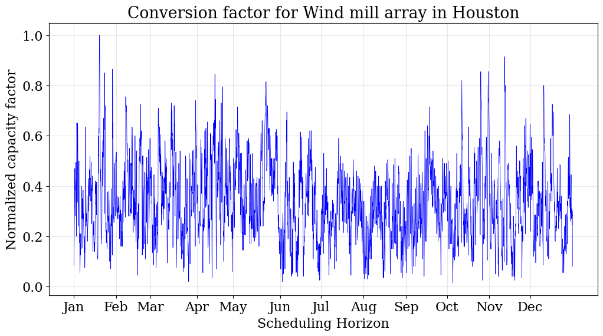
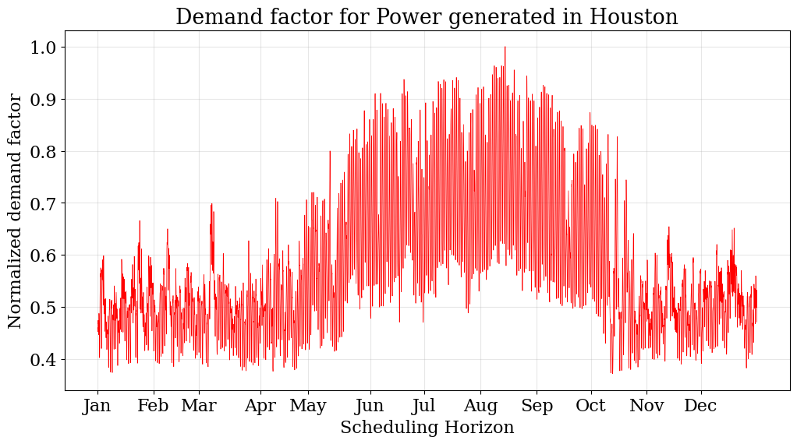
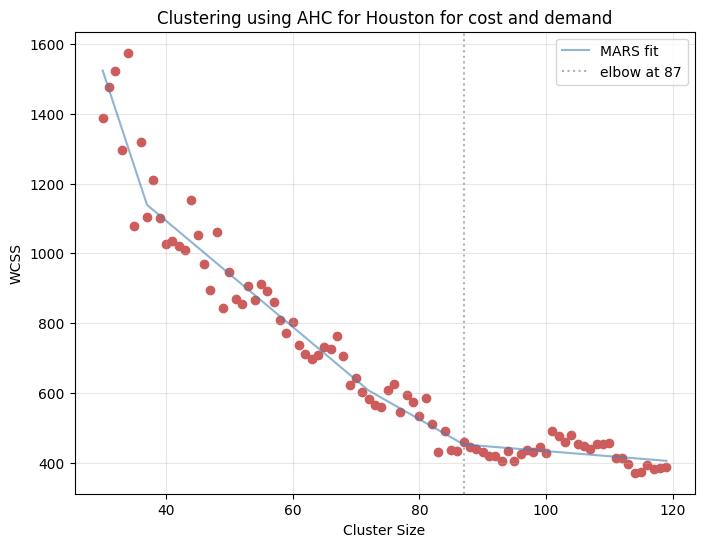
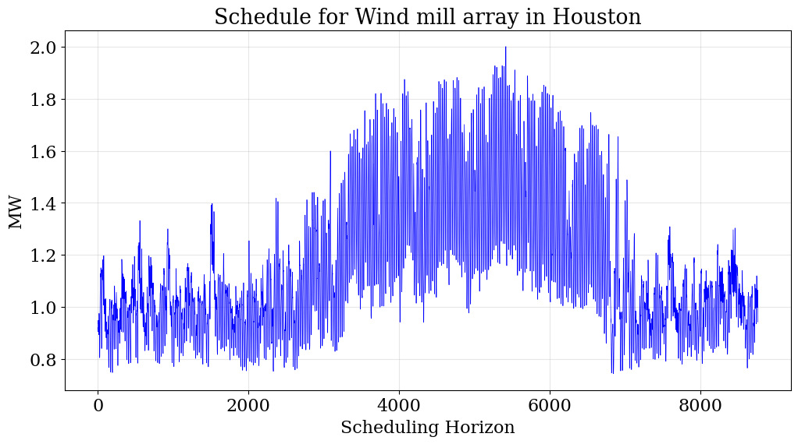
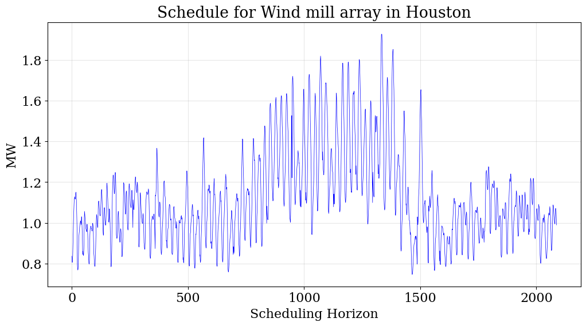

Agglomerative Hierarchial Clustering (AHC) example
==================================================

In this example, we highlight the scenario aggregation capabilities of energiapy

Consider the example stated in the *small example*. 

However, let us use data the following data for Houston:

- demand data for power at an hourly resolution from ERCOT
- solar and wind capacities at an hourly resolution from NREL NSRDB

The temporal scale in it's entirety has 8760 time periods

The problem can be modeled over three scales

- 0, network scale with 1 time period where the network decisions such as setting up a unit are taken
- 1, a daily scale for convenience with 365 time periods, if the demand is to be met on a daily basis 
- 2, scheduling and demand scales with 8760 time periods, where the resource flows are determined

Given the large problem size, the model can be aggregated using Agglomerative Hierarchial Clustering (AHC) which provides
a set of representative days over which the problem can be solve. Understandably, there is a loss of model accuracy.

**Import modules**

.. code-block:: python

    import pandas 
    import numpy
    from energiapy.components.temporal_scale import Temporal_scale
    from energiapy.components.resource import Resource, VaryingResource
    from energiapy.components.process import Process, VaryingProcess
    from energiapy.components.material import Material
    from energiapy.components.location import Location
    from energiapy.components.scenario import Scenario
    from energiapy.components.result import Result 
    from energiapy.model.formulate import formulate, Constraints, Objective
    from energiapy.utils.nsrdb_utils import fetch_nsrdb_data
    from energiapy.plot import plot
    from energiapy.model.solve import solve
    from energiapy.aggregation.ahc import agg_hierarchial, agg_hierarchial_elbow, Include, Fit
    from energiapy.aggregation.reduce_scenario import reduce_scenario, Clustermethod
    from energiapy.utils.data_utils import load_results

**Declare temporal scale**

With 1 year, 365 days, and 24 hours in each day. 

.. code-block:: python
    
    scales = Temporal_scale(discretization_list= [1, 365, 24])

**Declare the model**

This is the same problem as shown in *small example*. 

.. code-block:: python

    Solar = Resource(name='Solar', cons_max=100, basis='MW', label='Solar Power')

    Wind = Resource(name='Wind', cons_max= 100, basis='MW', label='Wind Power')

    Power = Resource(name='Power', basis='MW', demand = True, label='Power generated', varying = VaryingResource.deterministic_demand)

    LiI = Process(name='LiI', storage= Power, capex = 1302182, fopex= 41432, vopex = 2000,  store_max=1000, label='Lithium-ion battery', basis = 'MW')

    WF = Process(name='WF', conversion={Wind: -1, Power: 1},capex=990637, fopex=3354, vopex=4953, prod_max=100, label='Wind mill array', varying= VaryingProcess.deterministic_capacity, basis = 'MW')

    PV = Process(name='PV', conversion={Solar: -1, Power: 1}, capex=567000, fopex=872046, vopex=90000, prod_max=100, varying = VaryingProcess.deterministic_capacity, label = 'Solar PV', basis = 'MW')

**Import location level data**

The solar and wind availability data for Houston can be fetched using the fetch_nsrdb_data function.

.. code-block:: python 

    weather_houston = pandas.read_csv('data/ho_solar19.csv')
    weather_houston =  weather_houston.rename(columns = {'Unnamed: 0': 'date'})
    weather_houston = weather_houston.set_index('date')

The demand data for Houston can be downloaded for the ERCOT website

.. code-block:: python 
    demand_houston = pandas.read_excel('data/Native_Load_2019.xlsx')[['COAST']]
    demand_houston = demand_houston.set_index(weather_houston.index)

**Declare Location**

Here we declare a Location 'houston' with embedded hourly data for wind and solar availability, and power demand

.. code-block:: python 

    houston = Location(name='HO', processes= {LiI, PV, WF}, capacity_factor = {PV: pandas.DataFrame(weather_houston['dni']), \
    WF: pandas.DataFrame(weather_houston['wind_speed'])}, demand_factor = {Power: pandas.DataFrame(demand_houston)}, scales=scales, label='Houston', demand_scale_level=2, \
        capacity_scale_level= 2, cost_scale_level= 1)

**Plotting input data**

The input data can be plotted using the native plotting function plot for capacity_factor and demand_factor.

**Generate the full-scale MILP**

We include constraints for cost, inventory, production, and resource_balance.

.. code-block:: python 

    milp = formulate(scenario= scenario, demand = {houston: {Power: 2}}, constraints={Constraints.cost, Constraints.inventory, Constraints.production, Constraints.resource_balance}, \
            objective=Objective.cost)
 

**Solve the full-scale model**

We solve the generated MILP using the Gurobi solver.

.. code-block:: python 

    results = solve(scenario = scenario, instance= milp, solver= 'gurobi', name=f"results", print_solversteps = True)

**Determining the optimal cluster size**

The within cluster sum of squares (WCSS) are a good indication of the error in clustering. We include capacity, and demand factors in the include field.
The elbow point can be determine as shown here. 

First, determine the WCSS for a reasonable range of clusters

.. code-block:: python

    wcss = agg_hierarchial_elbow(scenario= scenario, scale_level=1, include= [Include.capacity, Include.demand], range_list = list(range(30,120)))

Next, we apply Multivariate Adapative Regression Splines (MARS) to determine the elbow point 

**Generate a reduced scenario**

The reduce_scenario function provides a reduced scenario, the set of representative days and some related information, such as the total WCSS.

.. code-block:: python

    milp_reduced = formulate(scenario= scenario_reduced, demand = { houston: {Power: 2}}, constraints={Constraints.cost, Constraints.inventory, Constraints.production, Constraints.resource_balance}, \
        objective=Objective.cost)

**Solve the reduced scenario**
The reduced scenario can then be solved, and the error can be ascertained.

.. code-block:: python

    results_reduced = solve(scenario = scenario_reduced, instance= milp_reduced, solver= 'gurobi', name=f"reduced_res", print_solversteps = True)
    
    error = (results.output['objective'] - results_reduced.output['objective'])*100/results.output['objective']

**Plotting results**

Native plotting functions can be used to plot results such as the optimal schedule and capital utilization as shown. 
Here, we are plotting production schedule for both the full scale as well as the reduced scenario.

.. code-block:: python 

    plot.schedule(results = results, location='HO', component='WF', y_axis= 'P')
    plot.schedule(results = results_reduced, location='HO', component='WF', y_axis= 'P')

