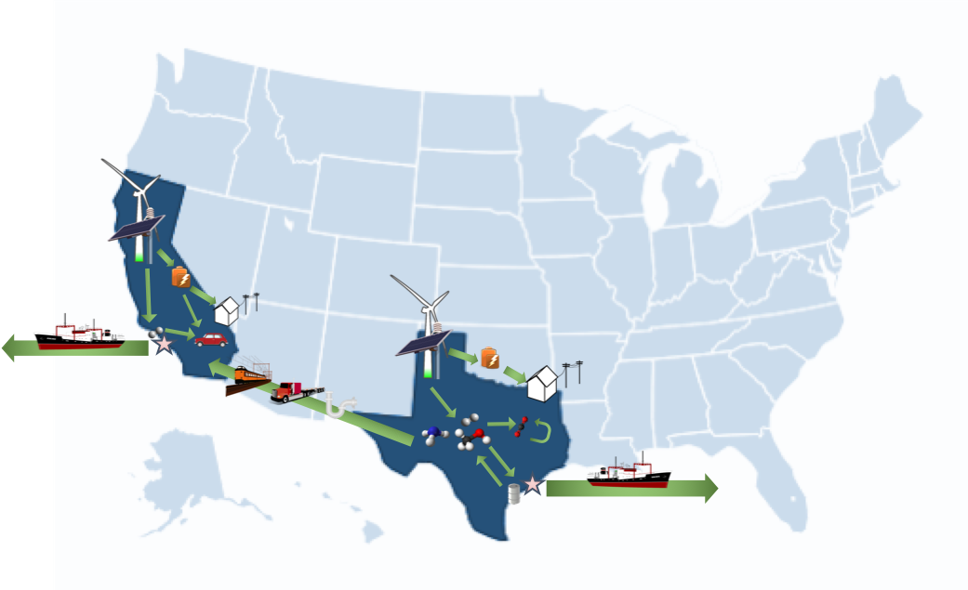
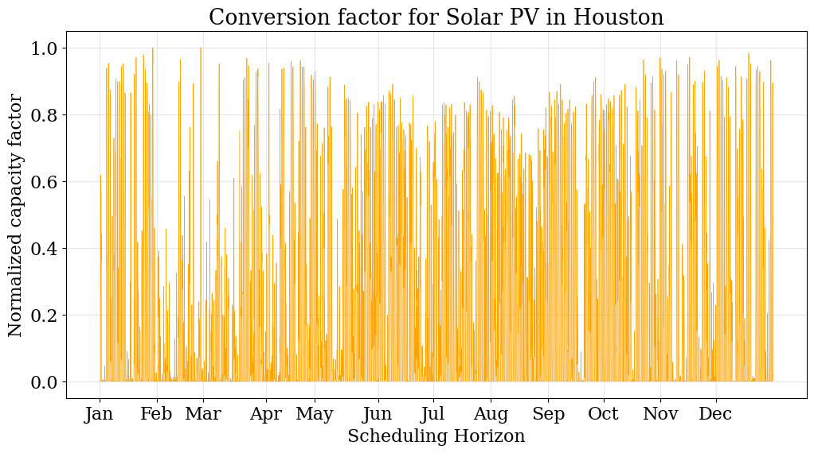
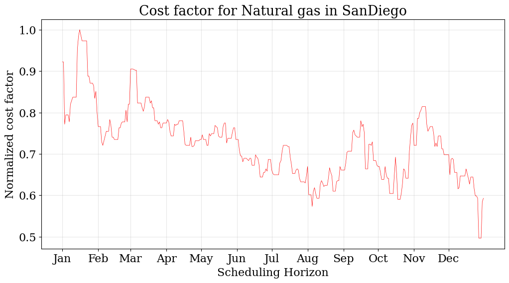
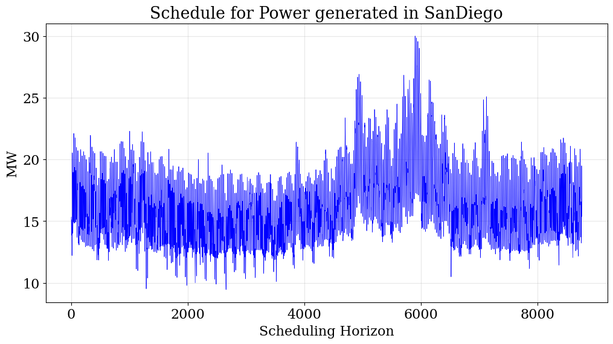

Multi-location Energy Systems MILP Example
==========================================

This is an example implementation of the energiapy python module for a problem instance with multiple locations

energiapy relies on the resource task network (RTN) approach:

In the RTN representation, systems can be visualized as transitional elements which convert resources into other resources.
The distinction between and energy and material resources is merely illustrative. Mathematically, resources are treated consistently throughout the framework

The key goals are to:

1. Identify synergies between material and energy supply chains 
2. Propose network designs for future energy systems
3. Perform scenario analysis to identify critical components

The systems modeled in the example case study include:

* dense energy carrier (DEC) production; e.g. hydrogen through electrolysis and methane reforming, production of methanol through a novel catalytic process
* carbon capture, utilization, and sequestration; e.g. direct air capture (DAC), sequestration in aquifers, utilization to produce methanol  
* power generation; e.g. solar, wind, natural gas
* transportation networks; e.g. trains and pipeline for the transport of energy vectors.

**Nomenclature**

*Sets*

- R - set of all resources r
- P - set of all processes p
- T - set of temporal periods t
- B - set of transport modes b
- L - set of locations l

*Subsets*

- R\ :sup:`storage` - set of resources that can be stored
- R\ :sup:`sell` - set of resources that can be discharged
- R\ :sup:`demand` - set of resources that meet  demand
- R\ :sup:`cons` - set of resources that can be consumed
- P\ :sup:`uncertain` - set of processes with uncertain capacity
- R\ :sup:`trans` - set of resources that can be transported
- T\ :sup:`sch` - set of temporal periods t for scheduling decisions
- T\ :sup:`net`- set of temporal periods t for network decisions
- L\ :sup:`source` - set of source locations 
- L\ :sup:`sink` - set of sink locations 

*Continuous Variables*

- P\ :sub:`l,p,t`- production level of p :math:`{\in}`  P in time period t :math:`{\in}` T\ :sup:`sch`  

- C\ :sub:`l,r,t`- consumption of r :math:`{\in}` in R\ :sup:`cons` time period t :math:`{\in}` T\ :sup:`sch` 

- S\ :sub:`l,r,t`- discharge of r :math:`{\in}` in R\ :sup:`demand` time period t :math:`{\in}` T\ :sup:`sch` 

- Inv\ :sub:`l,r,t`- inventory level of r :math:`{\in}` R\ :sup:`storage`  in time period t :math:`{\in}` T\ :sup:`sch` 

- Cap\ :sup:`S` \ :sub:`l,r,t` - installed inventory capacity for resource r :math:`{\in}`  R\ :sup:`storage` in time period t :math:`{\in}` T\ :sup:`net` 

- Cap\ :sup:`P` \ :sub:`l,p,t` - installed production capacity for process p :math:`{\in}` P in time period t :math:`{\in}` T\ :sup:`net` 

- Trans\ :sup:`out` \ :sub:`b,l,l',p,t` - amount of r :math:`{\in}` R through mode b :math:`{\in}` B in time period t :math:`{\in}` T\ :sup:`net` 

- Trans\ :sup:`in` \ :sub:`b,l,l',p,t` - amount of r :math:`{\in}` R through mode b :math:`{\in}` B in time period t :math:`{\in}` T\ :sup:`net` 

*Binary Variables*

- X\ :sup:`P` \ :sub:`l,p,t` - network binary for production process p :math:`{\in}` P
- X\ :sup:`S` \ :sub:`l,r,t` - network binary for inventory of resource r :math:`{\in}`  R\ :sup:`storage` 
- X\ :sup:`B` \ :sub:`b,l,l',r,t` - binary for transport of resource r :math:`{\in}` R\ :sup:`trans`   between locations

*Parameters*

- Cap\ :sup:`P-max` \ :sub:`l,p,t` - maximum production capacity of process p :math:`{\in}` P in time t :math:`{\in}` T\ :sup:`net`
- Cap\ :sup:`S-max` \ :sub:`l,r,t` - maximum inventory capacity for process r :math:`{\in}` R\ :sup:`storage` in time t :math:`{\in}` T\ :sup:`net`
- Capex\ :sub:`l,p,t` - capital expenditure for process p :math:`{\in}` P in time t :math:`{\in}` T\ :sup:`net`
- Vopex\ :sub:`l,p,t` - variable operational expenditure for process p :math:`{\in}` P in time t :math:`{\in}` T\ :sup:`sch`
- Price\ :sub:`l,r,t` - purchase price for resource r :math:`{\in}` R\ :sup:`cons` in time t :math:`{\in}` T\ :sup:`sch`
- C\ :sup:`max` \ :sub:`l,r,t` - maximum consumption availability for resource r :math:`{\in}` R\ :sup:`cons` in time t :math:`{\in}` T\ :sup:`sch`
- D\ :sub:`l,r,t` - demand for resource r $in$ R\ :sup:`sell` in time t :math:`{\in}` T\ :sup:`sch`
- Trans\ :sup:`cost` \ :sub:`b,r,t- transport cost for resource r $in$ R\ :sup:`trans` in time t :math:`{\in}` T\ :sup:`sch` for mode b :math:`{\in}` B

**MILP Formulation**

A multi-location, multi-product energy system model can be formulated as shown here 

.. math::
    \begin{equation}
        min \sum_{l \in \mathcal{L}} \Big(\sum_{t \in \mathcal{T}^{net}} \sum_{p \in \mathcal{P}} Capex_{l,p,t} \times Cap^P_{l,p,t} +  \sum_{t \in \mathcal{T}^{sch}} \sum_{p \in \mathcal{P}}  Vopex_{l,r,t} \times P_{l,r,t} 
    \end{equation}

.. math::
    \begin{equation*}
        \sum_{b \in \mathcal{B}} \Big(\sum_{t \in \mathcal{T}^{sch}} \sum_{l \in \mathcal{L}} Trans^{cost}_{b,r,t} Trans^{in}_{b,l,l',r,t} + \sum_{t \in \mathcal{T}^{sch}} \sum_{l \in \mathcal{L}} Trans^{cost}_{b,r,t}Trans^{out}_{b,l,l',r,t} \Big)
    \end{equation*}

.. math::
    \begin{equation*}
        + \sum_{t \in \mathcal{T}^{sch}} \sum_{r \in \mathcal{R}^{cons}} C_{l,r,t} \times Price_{l,r,t} \Big)
    \end{equation*}

.. math::
    \begin{equation}
        Cap^S_{l,r,t} \leq Cap^{S-max}_{l,r,t} \times X^S_{l,r,t} \hspace{1cm} \forall r \in \mathcal{R}^{storage}, t \in \mathcal{T}^{net}
    \end{equation}

.. math::
    \begin{equation}
        Cap^P_{l,p,t} \leq Cap^{P-max}_{l,p,t} \times X^P_{l,p,t}  \hspace{1cm} \forall p \in \mathcal{P}, t \in \mathcal{T}^{net}, l \in \mathcal{L}
    \end{equation} 

.. math::
    \begin{equation}
        Trans^{in/out}_{b, l, l', r,t} \leq Trans^{max-in/out}_{b, l,l', r,t} \times X^B_{b,l,l',r,t} \hspace{1cm} \forall r \in \mathcal{R}, t \in \mathcal{T}^{sch} , (l,l') \in \mathcal{L}^2, b \in \mathcal{B} 
    \end{equation}

.. math::
    \begin{equation}
        \sum_{p \in \mathcal{P}} P_{l,p,t} \times \eta(p,r) + C_{l,r,t} + \sum_{l' \in \mathcal{L} \cap {l}}Trans^{in}_{l,l',r,t} = \sum_{l' \in \mathcal{L} \cap {l}} Trans^{out}_{l,l',r,t} + Inv_{l,r,t} + S_{l,r,t}  
    \end{equation}

.. math::
    \begin{equation*}
        \forall r \in \mathcal{R}^{cons}, t \in \mathcal{T}^{sch}, l \in \mathcal{L}
    \end{equation*}

.. math::
    \begin{equation}
        S_{l,r,t}, C_{l,r,t}, Inv_{l,r,t}, P_{l,p,t}, Cap^P_{l,p,t}, Cap^S_{l,r,t}, Trans^{in/out}_{b,l,l',r,t} \in R_{\geq 0}
    \end{equation}

The problem can now modeled in energiapy

**import modules**

.. code-block:: python 

    import pandas 
    from energiapy.components.temporal_scale import Temporal_scale
    from energiapy.components.resource import Resource, VaryingResource
    from energiapy.components.process import Process, VaryingProcess
    from energiapy.components.material import Material
    from energiapy.components.location import Location
    from energiapy.components.network import Network
    from energiapy.components.scenario import Scenario
    from energiapy.components.transport import Transport
    from energiapy.components.result import Result 
    from energiapy.utils.data_utils import make_henry_price_df, remove_outliers
    from energiapy.model.formulate import formulate, Constraints, Objective
    from energiapy.utils.nsrdb_utils import fetch_nsrdb_data
    from energiapy.plot import plot
    from energiapy.model.solve import solve

**import weather data**

The fetch_nsrdb function accesses the National Solar Radiation Database (NSRDB) Highly Scalable Datasets (HSDS) hosted by NREL on a Amazon Web Services (AWS) cloud through the h5py module To access large datasets, an API key can be requested from NREL. 

1. download data at any latitude longitude (globally) or state-county (because of repetition of county names) pairs within the US.

2. Skim and fetch data which match different specifications,  e.g. wind data for collection point at the highest elevation in the county.

3. While HSDS allows you to splice datasets, the script allows you to also find means within ranges.

4. Arrange data in a dataframe for multiscale analysis, with the temporal indices as tuples.  [Can be saved as .csv/.txt/.json/.pkl]

Here, we import solar data as dni and wind data as wind speed for most populated data point in Harris county (TX) and San Diego county (SD) at an hourly resolution

.. code-block:: python 

    weather_sandiego =  fetch_nsrdb_data(attrs = ['wind_speed', 'dni'], year = 2019, state = 'California', county = 'San Diego',\
            resolution= 'hourly', get = 'min-elevation', save = 'data/sd_solar19')[1] 

    weather_houston =  fetch_nsrdb_data(attrs = ['wind_speed', 'dni'], year = 2019, state = 'Texas', county = 'Harris',\
            resolution= 'hourly', get = 'min-elevation', save = 'data/ho_solar19')[1] 

**import natural gas prices**

Natural gas prices are from the Henry price index at a daily temporal resolution. 

The energia.make_henry_price_df function implicitly fills in gaps in data such as weekends and public holidays by repeating the last recorded prices
For e.g. if the 4th of July will use the price for the 3rd of July
a typical saturday and sunday will take the values for the last friday.

The stretch functionality stretches the values over the hourly temporal scale (8760) from a daily temporal scale (365), again through repetition.  

Moreover, we can remove outliers usig the remove_outliers features in data_utils

.. code-block:: python 

    ng_price = make_henry_price_df(file_name='data/Henry_Hub_Natural_Gas_Spot_Price_Daily.csv', year=2019, stretch=False)
    ng_price = ng_price.set_index(weather_sandiego.index[::24])
    ng_price = ng_price.drop(columns= 'scales')
    ng_price = remove_outliers(ng_price, sd_cuttoff = 3)

**Import demand data**

Here we import the power demand data for San Diego (CAISO for SDGE region) and Houston (ERCOT for COAST region)

.. code-block:: python 

    demand_sandiego = pandas.read_excel('data/HistoricalEMSHourlyLoad-2019.xlsx', index_col= 0)[['SDGE']]
    demand_houston = pandas.read_excel('data/Native_Load_2019.xlsx')[['COAST']]
    #Fix Index
    demand_sandiego = demand_sandiego.set_index(weather_sandiego.index)
    demand_houston = demand_houston.set_index(weather_houston.index)

**Define temporal scale**

The variabilities of energy systems are best captured over a discretized spatio-temporal scale. In energiapy, the first declaration is the temporal scale. 

For e.g.: Here we declare three temporal scales at different levels from right to left. The interpretation of these scales is merely symentic. Scales can be declared as the problem demands.
- 0, annual, with 1 discretization
- 1, daily with 365 discretization
- 2, hourly with 24 discretization

In essence, we are creating a temporal scale of 8760 points.

.. code-block:: python 

    scales = Temporal_scale(discretization_list=[1, 365, 24], start_zero= 2019)

**Declare resources**

Resources can be -

*consumed*, e.g. solar, wind

*purchased* (consumed at a cost), e.g. natural gas, water

*sold*, e.g. hydrogen, power

*produced*, e.g. hydrogen, methanol

*stored*, e.g. power as charge or elevated water, hydrogen as cryogenic or compressed

*discharged* (sold for 0 currency), e.g. CO2, O2 (could be assigned profit)

basis can be declared, maximum consumption and storage can be defined

selling and purchase costs can vary. Natural gas and power for example

labels and blocks can be defined

these can be represented as cost factors (0,1) multiplied to a base resource cost

.. code-block:: python

    Solar = Resource(name='Solar', cons_max=100, basis='MW', label='Solar Power')

    Wind = Resource(name='Wind', cons_max= 100, basis='MW', label='Wind Power')

    Power = Resource(name='Power', basis='MW', demand = True, label='Power generated', varying = VaryingResource.deterministic_demand)

    H2 = Resource(name='H2', basis='kg', label='Hydrogen', block='Resource')

    H2O = Resource(name='H2O', cons_max=10**10,
                price= 0.001, basis='kg', label='Water', block='Resource')

    CH4 = Resource(name='CH4', cons_max=10**10, price=1, basis='kg', label='Natural gas', varying=  VaryingResource.deterministic_price)

    CO2 = Resource(name='CO2', basis='kg', label='Carbon dioxide', block='Resource')

    CO2_Vent = Resource(name='CO2_Vent', sell=True, basis='kg', label='Carbon dioxide - Vented')

    O2 = Resource(name='O2', sell=True, basis='kg', label='Oxygen')

    CO2_DAC = Resource(name='CO2_DAC', basis='kg', label='Carbon dioxide - captured')

**Declare processes**

Processes convert a resource into another through the utilization of resources. 
Essentially, the model is developed as an RTN

.. code-block:: python

    LiI = Process(name='LiI', storage= Power, capex = 1302182, fopex= 41432, vopex = 2000,  prod_max=100, label='Lithium-ion battery', basis = 'MW')

    WF = Process(name='WF', conversion={Wind: -1, Power: 1},capex=990637, fopex=3354, vopex=4953, prod_max=100, label='Wind mill array', varying= VaryingProcess.deterministic_capacity, basis = 'MW')

    PV = Process(name='PV', conversion={Solar: -1, Power: 1}, capex=567000, fopex=872046, vopex=90000, prod_max=100, varying = VaryingProcess.deterministic_capacity, label = 'Solar PV', basis = 'MW')

    SMRH = Process(name='SMRH', conversion={Power: -1.11*10**(-3), CH4: -3.76, H2O: -23.7, H2: 1, CO2_Vent: 1.03, CO2: 9.332}, capex =2520, fopex = 945, vopex = 0.0515,\
        prod_max= 10000, label='Steam methane reforming + CCUS')

    SMR = Process(name='SMR', capex = 2400, fopex = 800, vopex = 0.03,  conversion={Power: -1.11*10**(-3), CH4: -3.76, H2O: -23.7, H2: 1, CO2_Vent: 9.4979}, prod_max=10000, label='Steam methane reforming')

    H2FC = Process(name='H2FC', conversion = {H2:-50, Power: 1}, capex =  1.6*10**6, vopex = 3.5, fopex = 0, prod_max = 100, label = 'hydrogen fuel cell')

    DAC = Process(name='DAC', capex = 0.02536, fopex = 0.634, vopex = 0, conversion={Power: -1.93*10**(-4), H2O: -4.048, CO2_DAC: 1}, prod_max=10000, gwp=0, label='Direct air capture')

**Declare locations**

Locations have a set of available processes, the deterministic variability for the:

- price of purchase (consumption) of resource; natural gas in this case.
  
- demand data; mileage in this case
  
- capacities; here we use dni and windspeed data to capture the intermittent availability of solar and wind power

Note that there is absolutely no limitations on the number of variable resources (demand, purchase price) or processes (capacity) you can consider. 

The scale levels [0,1,2] can be used to declare the resolution at which to handle demand, capacity, and cost.

Note that not all of these are required to build a problem.

.. code-block:: python

    houston = Location(name='HO', processes= {LiI, PV, WF, SMRH, SMR, H2FC, DAC}, demand_factor= {Power: demand_houston}, cost_factor = {CH4: ng_price}, \
        capacity_factor = {PV: pandas.DataFrame(weather_houston['dni']), WF: pandas.DataFrame(weather_houston['wind_speed'])},\
            scales=scales, label='Houston', demand_scale_level=2, capacity_scale_level= 2, cost_scale_level= 1)

    sandiego = Location(name='SD', processes= {LiI, PV, WF, H2FC}, demand_factor= {Power: demand_sandiego}, cost_factor = {CH4: ng_price}, \
        capacity_factor = {PV: pandas.DataFrame(weather_sandiego['dni']), WF: pandas.DataFrame(weather_sandiego['wind_speed'])},\
            scales=scales, label='SanDiego', demand_scale_level=2, capacity_scale_level= 2, cost_scale_level= 1)

**Plotting input data**

energiapy also has significant plotting capabilities. 

The factors for demand, cost, and capacity can be plotted

.. code-block:: python

    plot.capacity_factor(location= sandiego, process= PV, color= 'orange')
    plot.capacity_factor(location= sandiego, process= WF, color= 'blue')
    plot.cost_factor (location= sandiego, resource= CH4, color= 'red')

**Declare transport options**

Transport objects translocate resources, and can have associated costs as well as transport losses.

.. code-block:: python

    Train_H2 = Transport(name= 'Train_H2', resources= {H2}, trans_max= 10000, trans_loss= 0.001, trans_cost= 1.667*10**(-3), label= 'Railway for hydrogen transportation')
    Pipe = Transport(name= 'Pipe', resources= {H2}, trans_max= 10000, trans_loss= 0.001, trans_cost= 0.5*10**(-3), label= 'Railroad transport')

**Declare network**

Networks link locations with transportation. The availability of differnt transport objects and the distances between the locations needs to be provided.

.. code-block:: python

    distance_matrix = [
        [0, 2366],
        [2366, 0]
                    ]

    transport_matrix = [
        [[], [Train_H2, Pipe]],
        [[Train_H2, Pipe], []] 
                    ]

    network = Network(name= 'Network', source_locations= [houston, sandiego], sink_locations= [houston, sandiego], distance_matrix= distance_matrix, transport_matrix= transport_matrix) 

**Declare scenario**

The combination of parameter data, locations, and transportation options generates a scenario. 

Scenarios are data sets that can be fed to models for analysis. 

In this case we are generating a scenario for a network with locations Houston and San Diego. The scales need to be consistent.

.. code-block:: python

    scenario = Scenario(name= 'dtw_example', network= network, scales= scales,  expenditure_scale_level= 1, scheduling_scale_level= 2, \
    network_scale_level= 0, demand_scale_level= 2, label= 'DTW_case')

**Formulate milp instance**

Models of different classes can be formulated based on the constraints considered.

In the following case, we optimize the cost while constraining inventory, production, resource balance, transport, and cost

.. code-block:: python

    milp = formulate(scenario= scenario, demand = {sandiego: {Power: 30}, houston: {Power: 20}}, \
    constraints={Constraints.cost, Constraints.inventory, Constraints.production, Constraints.resource_balance, Constraints.transport}, objective= Objective.cost)

**Solve the instance**

The instance can then be solved using an appropriate solver. Here we solve the problem using the Gurobi solver.

.. code-block:: python

    results = solve(scenario = scenario, instance= milp, solver= 'gurobi', name=f"Multi-Loc", print_solversteps = True)

**Plotting output**

The results can be analyzed, and used for illustrations.
Note that plotting of results requires the provision of the names as opposed to energiapy objects.

.. code-block:: python

    plot.schedule(results= results, y_axis= 'S', component= 'Power', location= 'SD')

