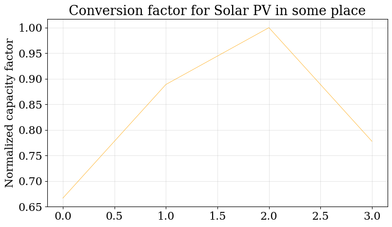
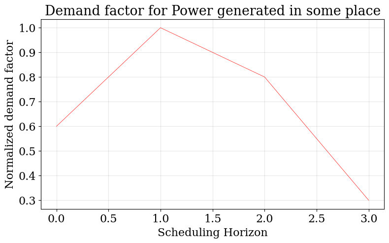
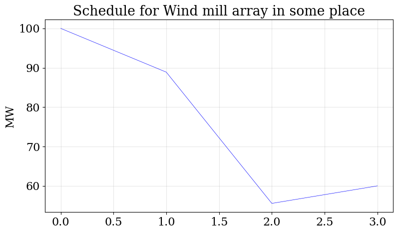
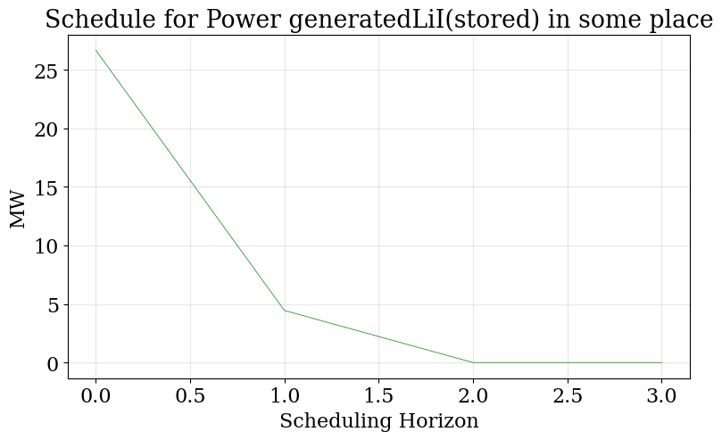

Small Energy Systems MILP Example
=================================

Consider a simple system with three processes

- Solar PV with varying capacity
- Wind Farm with varying capacity
- Lithium-ion battery storage

and varying demand for power.

The objective is to meet demand over four seasons by generating power using the PV and Wind Farm, 
storing the power in a Lithium-ion battery if necessary and meeting a varying demand for Power

The problem can be modeled over two scales

- 0, network scale with 1 time period where the network decisions such as setting up a unit are taken
- 1, scheduling and demand scales with 4 time periods, where the resource flows are determined

The problem is modeled as shown below

**Nomenclature**

The sets and variables used are stated here

*Sets*

- R - set of all resources r
- P - set of all processes p
- T - set of temporal periods p

*Subsets*

- R\ :sup:`storage` - set of resources that can be stored
- R\ :sup:`sell` - set of resources that can be discharged
- R\ :sup:`demand` - set of resources that meet  demand
- R\ :sup:`cons` - set of resources that can be consumed
- P\ :sup:`uncertain` - set of processes with uncertain capacity
- T - set of temporal periods 

*Continuous Variables*

- P\ :sub:`p,t` - production level of p :math:`{\in}`  P in time period t :math:`{\in}` T  
    
- C\ :sub:`r,t` - consumption of r :math:`{\in}` R\ :sup:`cons` time period t :math:`{\in}` T 
    
- S\ :sub:`r,t` - discharge of r :math:`{\in}` R\ :sup:`demand` time period t :math:`{\in}` T 
    
- Inv\ :sub:`r,t` - inventory level of r :math:`{\in}` R\ :sup:`storage`  in time period t :math:`{\in}` T
    
- Cap\ :sup:`S` \ :sub:`r` - installed inventory capacity for resource r :math:`{\in}`  R\ :sup:`storage` 
    
- Cap\ :sup:`P` \ :sub:`p` - installed production capacity for process p :math:`{\in}` P
    

*Binary Variables*

- X\ :sup:`P` \ :sub:`p` - network binary for production process p :math:`{\in}` P
- X\ :sup:`S` \ :sub:`r` - network binary for inventory of resource r :math:`{\in}` R\ :sup:`storage`

*Parameters*

- Cap\ :sup:`P-max` \ :sub:`p` - maximum production capacity of process p :math:`{\in}` P
- Cap\ :sup:`S-max` \ :sub:`r` - maximum inventory capacity for process r :math:`{\in}` R\ :sup:`storage`
- Capex\ :sub:`p` - capital expenditure for process p :math:`{\in}` P in time t :math:`{\in}` T
- Price\ :sub:`r,t` - purchase price for resource r :math:`{\in}` R\ :sup:`cons` in time t :math:`{\in}` T
- C\ :sup:`max` \ :sub:`r,t` - maximum consumption availability for resource r :math:`{\in}` R\ :sup:`cons` in time t :math:`{\in}` T}
- D\ :sub:`r,t` - demand for resource r in R\ :sup:`sell` in time t :math:`{\in}` T

**MILP Formulation**

Given is a general MILP modeling and optimization framework for simultaneous network design and scheduling for a single location problem.

.. math::
    \begin{equation}
        min \hspace{1cm} \sum_{p \in \mathcal{P}} Capex_p \times Cap^P_p + \sum_{t \in \mathcal{T}} \sum_{r \in \mathcal{R}^{cons}} C_{r,t} \times Price_{r,t}
    \end{equation}

.. math::
    \begin{equation}
        Cap^S_r \leq Cap^{S-max}_r \times X^S_r \hspace{1cm} \forall r \in \mathcal{R}^{storage}, t \in \mathcal{T}
    \end{equation}

.. math::
    \begin{equation}
        Cap^P_p \leq Cap^{P-max}_p \times X^P_p  \hspace{1cm} \forall p \in \mathcal{P}, t \in \mathcal{T}
    \end{equation} 

.. math::
    \begin{equation}
        P_{p,t} \leq Cap^{P}_p  \hspace{1cm} \forall p \in \mathcal{P}, t \in \mathcal{T}
    \end{equation} 

.. math::
    \begin{equation}
        Inv_{r,t} \leq Cap^{S}_r  \hspace{1cm} \forall r \in \mathcal{R}^{storage}, t \in \mathcal{T}
    \end{equation} 

.. math::
    \begin{equation}
        - S_{r,t} \leq - D_{r,t}  \hspace{1cm} \forall r \in \mathcal{R}, t \in \mathcal{T}
    \end{equation}

.. math::
    \begin{equation}
        C_{r,t} \leq C^{max}_{r,t} \hspace{1cm} \forall r \in \mathcal{R}, t \in \mathcal{T}
    \end{equation}

.. math::
    \begin{equation}
        - S_{r,t} + \sum_{p \in \mathcal{P}} P_{p,t} \times \eta(p,r) = 0 \hspace{1cm} \forall r \in \mathcal{R}^{sell}, t \in \mathcal{T}
    \end{equation}

.. math::
    \begin{equation}
        -Inv_{r,t} + \sum_{p \in \mathcal{P}} P_{p,t} \times \eta(p,r) = 0 \hspace{1cm} \forall r \in \mathcal{R}^{stored}, t \in \mathcal{T}
    \end{equation}

.. math::
    \begin{equation}
        \sum_{p \in \mathcal{P}} P_{p,t} \times \eta(p,r) + C_{r,t} = 0 \hspace{1cm} \forall r \in \mathcal{R}^{cons}, t \in \mathcal{T}
    \end{equation}

.. math::
    \begin{equation}
        S_{r,t}, C_{r,t}, Inv_{r,t}, P_{p,t}, Cap^P_p, Cap^S_r \in R_{\geq 0}
    \end{equation}

**Import modules**

.. code-block:: python

    import pandas 
    from energiapy.components.temporal_scale import Temporal_scale
    from energiapy.components.resource import Resource, VaryingResource
    from energiapy.components.process import Process, ProcessMode, VaryingProcess
    from energiapy.components.location import Location
    from energiapy.components.scenario import Scenario
    from energiapy.components.result import Result 
    from energiapy.model.formulate import formulate, Constraints, Objective
    from energiapy.plot import plot
    from energiapy.model.solve import solve

**Declare temporal scale**

Consider four seasons in a year.

Network decisions are taken annually (scale level 0)

Scheduling decisions are taken seasonally (scale level 1)

.. code-block:: python
    
    scales = Temporal_scale(discretization_list= [1, 4])

**Declare resources**

Resources can be declared with attributes such as maximum consumption (cons_max), resource price (price), maximum allowed inventory (store_max)

As also whether they can be discharged (sell), have to meet demand (demand)

.. code-block:: python

    Solar = Resource(name='Solar', cons_max=100, basis='MW', label='Solar Power')

    Wind = Resource(name='Wind', cons_max= 100, basis='MW', label='Wind Power')

    Power = Resource(name='Power', basis='MW', demand = True, label='Power generated', varying = VaryingResource.determinstic_demand)

**Declare processes**

Processes consume resources and can be of three type:

- storage, if storage = some_resource 
- single mode, as with the processes defined here wherein a conversions are provided
- multi mode, if a multiconversion dict is provided

.. code-block:: python

    LiI = Process(name='LiI', storage= Power, capex = 1302182, fopex= 41432, vopex = 2000,  prod_max=100, label='Lithium-ion battery', basis = 'MW')

    WF = Process(name='WF', conversion={Wind: -1, Power: 1},capex=990637, fopex=3354, vopex=4953, prod_max=100, label='Wind mill array', varying= VaryingProcess.determinstic_capacity, basis = 'MW')

    PV = Process(name='PV', conversion={Solar: -1, Power: 1}, capex=567000, fopex=872046, vopex=90000, prod_max=100, varying = VaryingProcess.determinstic_capacity, label = 'Solar PV', basis = 'MW')

**Location level input data**

Factors are normalized, and can be used to account for:

- variable resource demand (demand_factor)
- intermittent resource availability (capacity factor)
- varying resource purchase cost (cost factor)

.. code-block:: python

    demand_factor = pandas.DataFrame(data={'Power': [0.6, 1, 0.8, 0.3]})
    capacity_factor_pv = pandas.DataFrame(data={'PV': [0.6, 0.8, 0.9, 0.7]})
    capacity_factor_wf = pandas.DataFrame(data={'WF': [0.9, 0.8, 0.5, 0.7]})

**Declare location**

Locations are essentially a set of processes, the required resources are collected implicitly.

Location-wise capacity, demand, and cost factors can be provided. 

The scales of the capacity and demand data need to be provided as well.

.. code-block:: python

    place = Location(name='place', processes= {LiI, PV, WF}, demand_factor = {Power: demand_factor}, capacity_factor= {PV: capacity_factor_pv, WF:capacity_factor_wf}, capacity_scale_level= 1, demand_scale_level = 1, scales=scales, label='some place')

*plot varying factors*

Plotting functions in energiapy.plot can be used to plot the factors

.. code-block:: python

    plot.capacity_factor(location= place, process= PV, fig_size= (9,5), color= 'orange')
    plot.demand_factor(location= place, resource= Power, fig_size= (9,5), color= 'red')

**Declare scenario**

The combination of parameter data, locations, and transportation options generates a scenario. 

Scenarios are data sets that can be fed to models for analysis. 

In this case we are generating a scenario for the location houston. The scales need to be consistent.

The demand, network, scheduling, and expenditure scales need to be provided. They all default to 0.

.. code-block:: python

    case = Scenario(name= 'case', network= place, network_scale_level= 0, demand_scale_level = 1, scheduling_scale_level= 1, scales= scales, label= 'small scenario')

**Formulate MILP**

Models can be formulated using different constraints and objectives.

milp is a pyomo instance, additional constraints can be provided in a bespoke manner

.. code-block:: python

    milp = formulate(scenario= case, demand = {place: {Power: 200}}, constraints={Constraints.cost, Constraints.inventory, Constraints.production, Constraints.resource_balance}, \
        objective= Objective.cost)

**Solve**

To solve the model, the solve requires a scenario and a modeling instance to be provided. 

Also a solver needs to be chosen.

.. code-block:: python

    results = solve(scenario = case, instance= milp, solver= 'gurobi', name=f"MILP")

**Results**

Models can be summarized as shown below:

.. code-block:: python

    results.model_summary()

*Plot results*

Some handy plotting functions such as schedule can plot the production, consumption, sales, inventory schedules. 

In the example below, the production schedule for the windfarm (WF), and the inventory levels for stored power is shown. 

.. code-block:: python

    plot.schedule(results= results, y_axis= 'P', component= 'WF', location = 'place', fig_size= (9,5), color = 'blue')
    plot.schedule(results= results, y_axis= 'Inv', component= 'LiI_Power_stored', location = 'place', fig_size= (9,5), color = 'green')

All inputs are stored in results.component

All outputs are stored in results.output

Values can be accessed as shown below

.. code-block:: python

    results.output['X_P']
    results.output['Cap_P']